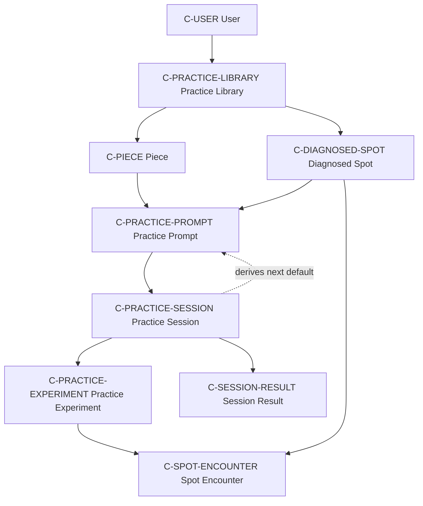

# Domain: guided piano practice

Cadence has one bounded context: **Guided Piano Practice**. Library, Guided
Session, and History are product areas within that context, not distinct
bounded contexts. DDD supplies stable language here; it does not require a
particular code architecture.

## Purpose

Cadence helps a pianist turn an initial playthrough into deliberate practice:
observe what happened, identify a specific problem, change one condition,
evaluate the result, return to musical context, and preserve the learning.

Cadence does not currently listen to, record, transcribe, or automatically
judge playing.

## Ubiquitous language

### C-USER — User

The person whose private practice data Cadence stores. A user owns exactly one
Practice Library. Identity is supplied by the hosting platform.

### C-PRACTICE-LIBRARY — Practice Library

The user's collection of Pieces, Practice Sessions, and continuing Diagnosed
Spots. A library is isolated from every other user's library.

### C-PIECE — Piece

A musical work in a Practice Library. Within one user's library, title plus
composer identifies a Piece. Key and meter are reusable metadata, not identity.

### V-PASSAGE-RANGE — Passage Range

An inclusive interval from one Measure-Beat Coordinate to another. It is a
value: equality depends on its coordinates, not an independent identifier.

### V-MEASURE-BEAT — Measure-Beat Coordinate

A one-based measure number and one-based beat position. Available beat
positions are the numerator of the Piece's meter: `6/8` exposes beats 1–6.

### C-PRACTICE-PROMPT — Practice Prompt

Editable instructions for the next Practice Session:

- Piece
- Passage Range
- practice goal
- Diagnosed Spots to revisit
- selected Practice Focus
- chunk size

The prompt says what to practise. It does not contain the outcome of completed
practice.

### C-PRACTICE-SESSION — Practice Session

One execution of the Cadence workflow from an initial Practice Prompt to a
saved Session Result. A completed session remains mutable in Practice History.

### C-DIAGNOSED-SPOT — Diagnosed Spot

An enduring practice concern with stable identity. It has a Passage Range,
observation category, priority, and review intention. A Spot may be discovered,
revisited, refined, and carried across Practice Sessions.

A Spot is not an anonymous value owned by only one Session. A Session records
an encounter with the Spot. Cadence does not yet define a formal open/resolved
lifecycle; that should emerge from use rather than be invented prematurely.

### C-SPOT-ENCOUNTER — Spot Encounter

What happened with a Diagnosed Spot during one Practice Session. It connects an
enduring Spot to session-specific observations and results.

### C-PRACTICE-FOCUS — Practice Focus

The primary fundamental selected for an experiment. The current vocabulary is:
Pitch, Fingering, Rhythm, Movement, Structure, Harmony, Inflection,
Articulation/touch, Balance/voicing, Dynamics, Pedaling, and Learning/memory.

The vocabulary and its coaching mappings are current truth but intentionally
provisional as the product is tested.

### C-PRACTICE-EXPERIMENT — Practice Experiment

A focused repetition combining a Diagnosed Spot, Practice Focus, chunk size,
coaching instruction, and success criterion.

### C-SESSION-RESULT — Session Result

Evidence produced during one Practice Session: purposeful repetition count,
pressure-test result, reflection, and other completed-session observations.
Session Results remain in History and do not become defaults for a new session.

## Concept relationships



## Domain invariants

### I-LIBRARY-ISOLATION

Every Piece, Practice Session, Diagnosed Spot, and related record belongs to
exactly one User. No operation may read or mutate another user's library.

### I-PIECE-IDENTITY

Within one Practice Library, `(normalized title, normalized composer)` uniquely
identifies a Piece. The required normalization rules are not yet specified.

### I-VALID-COORDINATE

Measure and beat numbers are positive. A beat may not exceed the numerator of
the applicable meter.

### I-RANGE-ORDER

A Passage Range is valid exactly when:

```text
start.measure < end.measure
OR
start.measure == end.measure AND start.beat <= end.beat
```

### I-PROMPT-RESULT-SEPARATION

A new Practice Prompt may carry forward prior prompts and unresolved work, but
must not carry forward Session Results. Repetition count, pressure result, and
reflection begin fresh.

### I-SPOT-CONTINUITY

When a Diagnosed Spot is carried between sessions, its stable identity is
preserved. The next session encounters the same Spot rather than creating an
unrelated copy with matching text or coordinates.

### I-PROMPT-OVERRIDABLE

Every carried-forward Practice Prompt value remains editable before or during
the new session where the workflow permits.

### I-HISTORY-MUTABLE

Completed Practice Sessions are mutable records, not an append-only audit log.
Editing a session does not rewrite provenance outside the product record.
