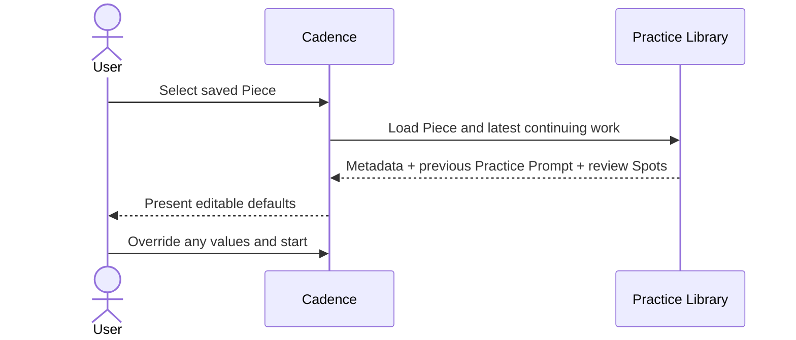
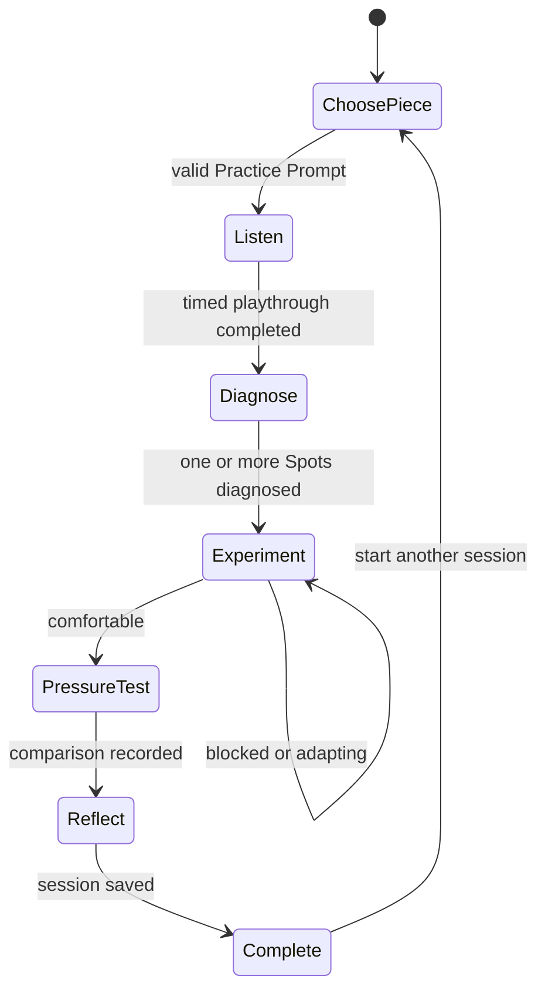

# Practice workflow

This artifact owns Cadence's externally observable practice behavior. The
current five-step sequence is normative, but expected to evolve through use.
Changes to the sequence are design changes even when motivated by usability.

## Starting a session

### R-START-PIECE

Every session begins by selecting an existing Piece or entering a new one.
Cadence must not begin with an implicit or unnamed Piece.

### R-START-RANDOM

The user may ask Cadence to select randomly from all saved Pieces in their own
Practice Library. Repeating the random attempt is easy and may produce another
Piece.

### R-PIECE-METADATA

Selecting a saved Piece supplies its composer, key, and meter. Each value is
editable. Piece title and composer together disambiguate works with the same
title.

### R-PROMPT-CARRY-FORWARD

Selecting a previously practiced Piece derives defaults from where practice
last stopped. Cadence preloads the latest relevant Practice Prompt:

- Passage Range
- goal
- Diagnosed Spots, especially those marked for review
- selected Practice Focus
- chunk size

The user may override every default. Per
[I-PROMPT-RESULT-SEPARATION](domain.md#i-prompt-result-separation), Cadence does
not preload repetition count, pressure result, or reflection.

## Guided sequence

### R-LISTEN-FIRST

The user first plays the chosen passage without intentionally stopping to fix
mistakes. The playthrough gathers evidence rather than judging success.

The circular play control starts and stops a timer only. It must not imply that
audio is recorded or retained. Audio recording is outside the current product.

The current observation vocabulary is Hesitation, Lost my place, Fingering
uncertainty, Coordination break, Restarted, and Memory gap.

### R-DIAGNOSE

After listening, the user records one or more Diagnosed Spots based on what
actually happened. Each Spot has a Passage Range, observation category, and
priority. The user selects a Spot before beginning an experiment.

Spot ranges satisfy [I-VALID-COORDINATE](domain.md#i-valid-coordinate) and
[I-RANGE-ORDER](domain.md#i-range-order).

### R-EXPERIMENT

The user selects a primary Practice Focus and smallest useful chunk. Cadence
maps that combination to one focused instruction and an explicit success
criterion. One repetition has one job.

After a repetition the user evaluates it as:

- **Still blocked** — reduce the load or chunk.
- **Challenged, adapting** — repeat with new awareness.
- **Comfortable** — increase challenge by returning to context.

Blocked and adapting remain in Experiment. Comfortable advances to Pressure
Test. The fundamental vocabulary and mappings are normative current truth but
provisional product content.

### R-PRESSURE-TEST

The user removes the artificial practice condition, begins before the Spot,
and plays through normally. They compare the result with the initial
playthrough as Less secure, About the same, or Clearly better.

### R-REFLECT

The user records what they understand now that they did not understand before
and chooses which enduring Spots should be reviewed in a later session.

### R-SAVE-SESSION

Saving preserves the Practice Prompt, Spot encounters, and Session Result in
the user's Practice Library. Saving completes the guided sequence.

## Practice history

### R-HISTORY-VIEW

The user can inspect prior sessions, including Piece metadata, Passage Range,
goal, repetitions, focus, pressure result, reflection, and Spot encounters.

### R-HISTORY-EDIT

The user can edit completed session records. The current intended editing scope
includes Passage Range, goal, repetition count, focus, pressure result,
reflection, and review intention. Editing enduring Spot details and Piece
metadata remains unresolved.

### R-REVIEW-SPOTS

Spots marked for review are actively surfaced and preloaded into the next
relevant Practice Prompt. A review marker is not merely decorative history.

## Explicitly provisional behavior

- The five-step ordering and transition gates may change after usability tests.
- The Practice Focus vocabulary and coaching mappings may evolve.
- Cadence does not yet specify how a Spot becomes resolved.
- Session duration is not part of the current Practice Prompt or Session Result.
- The product does not yet specify whether navigation backward within an active
  session should be allowed.
