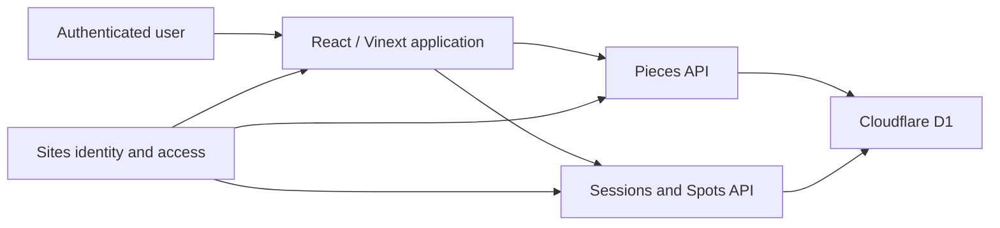

# System design

Cadence is a young production-worthy personal tool whose design anticipates
multiple users. Evolving UX is acceptable; loss or cross-user exposure of real
practice data is not.

## Runtime boundary

- The browser provides the guided interaction and transient active-session
  state.
- Server routes validate identity, ownership, input, and persistence rules.
- D1 stores durable Practice Libraries.
- Sites supplies deployment, sign-in identity, and outer access control.
- Audio, MIDI, score parsing, and automatic performance analysis are outside
  the current boundary.

## Identity and ownership

### S-IDENTITY

Server operations derive the current User from trusted hosting identity, not
from a client-supplied user identifier.

### S-OWNERSHIP

Durable Pieces, Sessions, Spots, and associations include ownership sufficient
to enforce [I-LIBRARY-ISOLATION](domain.md#i-library-isolation). Every read,
create, and update is scoped to the authenticated User.

Changing the Site from private to shared or public must not weaken data
isolation. Outer access policy is not a substitute for row ownership.

## Persistence model

The intended semantic model is:

- User owns Practice Library.
- Practice Library owns Pieces and enduring Diagnosed Spots.
- Practice Session references one Piece and its initial Practice Prompt, and
  snapshots the Piece meter used to interpret its historical coordinates.
- A backfilled meter snapshot records that it was inferred. An inferred snapshot
  may preserve unchanged historical coordinates that exceed its bound; new or
  edited coordinates may not use that exception.
- Spot Encounter connects a Practice Session to an enduring Diagnosed Spot.
- Practice Session owns one Session Result.

The physical schema need not mirror every concept one-to-one, but it must
preserve stable Spot identity, Prompt/Result separation, ownership, and valid
references.

### S-PERSISTENCE-EVOLUTION

Every change to stored structure or meaning must state how existing data remains
usable. The reviewed change must include one of: an inspected migration; an
audited finding that no affected data exists; or temporary backward
compatibility with an explicit condition for removing it. Schema migrations
and semantic value migrations are both persistence changes. Silent destructive
resets are not acceptable for production data.

## Interfaces

The current application exposes two same-origin JSON route families.

### Pieces

- List the current User's Pieces.
- Create or update a Piece identified by title and composer.
- Reject empty titles and cross-user access.
- Return enough metadata to construct a new Practice Prompt.

### Sessions and continuing work

- List the current User's recent Practice Sessions.
- Retrieve the latest relevant Practice Prompt for a Piece.
- Create a Practice Session from an owned Piece and valid prompt.
- Update a mutable owned Practice Session.
- Retrieve and carry forward enduring review Spots without losing identity.

Specific HTTP payload shapes are implementation interfaces, not yet stable
public APIs. They should be tested because the client depends on them.

## Validation responsibilities

The server, not only the UI, enforces:

- authenticated ownership;
- valid Piece identity;
- enumerated meter, observation, focus, priority, and result values;
- [I-VALID-COORDINATE](domain.md#i-valid-coordinate);
- [I-RANGE-ORDER](domain.md#i-range-order);
- references to owned Pieces and Spots;
- [I-PROMPT-RESULT-SEPARATION](domain.md#i-prompt-result-separation).

Client validation provides immediate feedback but is not a security or data
integrity boundary.

## Reliability and review risks

Changes deserve increased human attention when they affect:

- identity or ownership queries;
- migrations or persistent-state semantics;
- Prompt carry-forward behavior;
- stable Spot identity or session/spot associations;
- coordinate validation;
- mutability of historical data;
- interpretation of the guided workflow.

Build, lint, API tests, domain property tests, and accessibility checks are
expected sensors. A passing build alone is insufficient evidence of product
conformance.

## Known conformance gaps in the current repository

These gaps document disagreement between current intent and implementation;
they do not authorize fixes outside a reviewed change.

- D1 records have no User ownership and API operations are not user-scoped.
- Spots are anonymous JSON inside Sessions rather than enduring identities.
- Review intention is session-level and does not preload specific Spots.
- Latest-session restoration carries only range and goal, not the full Practice
  Prompt defined by `C-PRACTICE-PROMPT`.
- The timer control visually resembles audio recording.
- Opaque legacy meter values remain usable but cannot supply a beat upper bound.
  Audit and migrate any such values, then remove their compatibility exception.
- Backfilled Session meters remain marked as inferred. Add a way to confirm or
  correct each historical meter before clearing that provenance and removing
  its unchanged-coordinate compatibility exception.
- Random Piece selection is not user-scoped by the data model.
- Product tests do not cover the normative workflow or persistence behavior.
- Root `index.html` and `app.js` are an obsolete local-storage implementation;
  the deployed runtime is the application under `app/`.
- Starter README and example files do not describe the Cadence product.

## Current deployment assumption

The deployed Site is owner-only today. That reduces immediate exposure but does
not satisfy the multi-user design. Multi-user sharing must not be enabled until
`I-LIBRARY-ISOLATION` has executable evidence.
